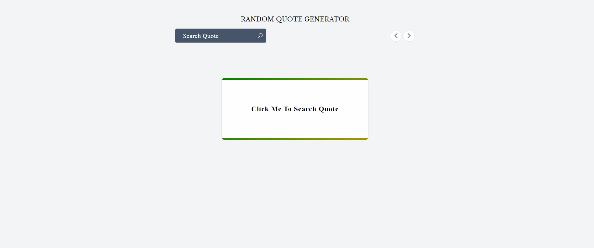

# Random Quote Generator

A brief description of what this project does and who it's for

## Demo



## Tech Stack

React, TailwindCSS, localforage, reactQuery

## Getting Started

To Run the App in developement server

```bash
git clone https://github.com/yawai990/randomquotegenerator.git
```

## Installing Dependency

```bash
npm install
```

## Environment Variables

To run this project, you will need to add the following environment variables to your .env file
NOTE:: .env file should be placed9 in root foldere

```bash
VITE_QUOTE_URL=https://api.adviceslip.com/advice
```

### Run In developement

```bash
npm run dev
```

The app will run in http://localhost:3000
